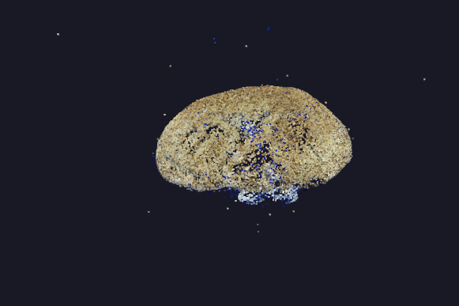
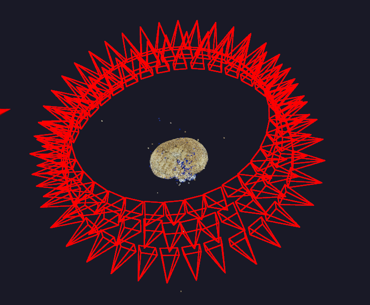

# 三维重建 (Structure from Motion)

纯 Python + OpenCV 实现的增量式 SfM 管道，从多视角图像恢复相机位姿和三维稀疏点云。

## 数据集要求

图片需满足以下条件：
- **同一相机**拍摄（内参 K 恒定）
- 相邻帧之间有**足够重叠**（~70%+）
- 图片为相机/手机直出 JPG（带 EXIF 焦距信息）；无 EXIF 时自动回退到 F 矩阵估计
- 推荐 50-200 张，JPEG/PNG 格式

示例数据集：`Cat_RGB/` — 108 张 2272×1704 JPG（Panasonic DMC-GF6, 33mm, 绕物体 3 圈）。

## 快速开始

```bash
pip install opencv-python numpy scipy matplotlib open3d pillow
python main.py
```

结果输出到 `output/` 目录。

## 结果展示

**稀疏点云** (77K SIFT 特征点三角化)：



**点云 + 相机视锥** (108 台相机，红色视锥)：



## 查看结果

```bash
# 方法1: 内置查看器
python view_ply.py output/sparse_cloud.ply
python view_ply.py output/cloud_with_frustums.ply  # 点云 + 相机视锥

# 方法2: MeshLab (免费, 推荐)
# https://www.meshlab.net/ → File → Import Mesh → 选择 .ply

# 方法3: CloudCompare (免费)
# https://www.cloudcompare.org/ → File → Open
```

## 管道流程

```
main.py
  ├── self_calibration.py        # EXIF 读取焦距 → 精确 K
  ├── feature_matching.py        # SIFT + FLANN (ratio test)
  ├── sfm_pipeline.py            # 增量式 SfM
  ├── bundle_adjustment.py       # 迭代 PnP LM + 多视图重三角化
  ├── export_results.py          # PLY 导出 (点云 + 相机视锥)
  └── visualize.py               # open3d 交互可视化
```

## 关键技术

| 步骤 | 方法 |
|------|------|
| 自标定 | EXIF 读取焦距 + 传感器尺寸查表 |
| 特征 | SIFT, FLANN + Lowe's ratio test (0.7) |
| 初始化 | 候选间隔帧评分，选 E 内点最多的相邻对 |
| 位姿估计 | F (RANSAC) → E → Cheirality 选解 |
| 增量注册 | PnP EPnP + RANSAC, 200 迭代 |
| 发散检测 | 步长 > 历史中位数×2 + 跳变 > 预期×10 |
| BA | 迭代 PnP LM (motion-only) + 最大基线重三角化 |
| 过滤 | 重投影误差 5px + 距离 MAD 鲁棒过滤 |

## 输出

| 文件 | 内容 |
|------|------|
| `output/sparse_cloud.ply` | ~77K 稀疏三维点 (SIFT 三角化) |
| `output/cloud_with_frustums.ply` | 点云 + 108 个红色相机视锥 |
| `output/cameras.npz` | 相机内参 K + 外参 R, t |

## 性能

- 108 张 1200px 图片 → ~2 分钟
- 相机注册率: 100% (108/108)
- 重投影误差中位数: ~0.11 px

## 文件结构

```
立体重构/
├── Cat_RGB/                  # 输入图片
├── main.py                   # 主入口
├── self_calibration.py       # 自标定 (EXIF)
├── feature_matching.py       # 特征提取与匹配
├── sfm_pipeline.py           # 增量式 SfM
├── bundle_adjustment.py      # 光束法平差
├── export_results.py         # 导出 PLY
├── visualize.py              # open3d 可视化
├── view_ply.py               # 独立 PLY 查看器
├── output/                   # 输出目录
├── README.md                 # 本文件
├── 说明文档.md               # 算法详细说明
└── 要求.md                   # 原始需求
```

## 依赖

- OpenCV ≥ 4.5 (SIFT 已入主包)
- NumPy, SciPy
- open3d ≥ 0.18 (可视化)
- Pillow (EXIF 读取)
- Matplotlib (可选)

## 已知限制

- 增量式 SfM 在早期帧有轻微偏差，中后期与 COLMAP 偏差 < 0.1 单位
- BA 为 motion-only (不优化 3D 点)，全局收敛性不如 Ceres/g2o
- 无闭环检测，长序列 (> 200 张) 可能有累积漂移
